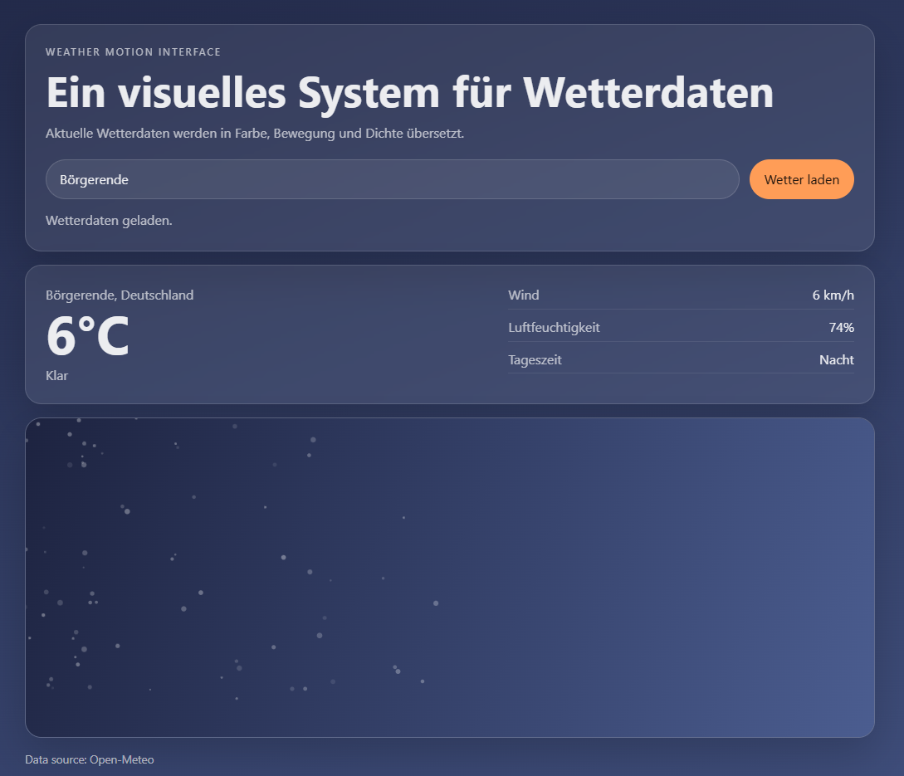

# Weather Motion Interface

An experimental interface that translates real-time weather data into color, motion and atmosphere.
​

Instead of presenting weather as static information, this project explores how data can become a visual experience.

---

## Concept

Weather is not only information — it has mood, density and movement.

This project maps weather data to visual parameters:

- temperature → color
- wind → particle movement
- day/night → light and contrast
- weather conditions → visual density and behavior

---

## Features (Phase 1)

- City search (Open-Meteo Geocoding API)
- Real-time weather data
- Temperature, wind, humidity and day state
- Canvas-based visual system
- Particle motion influenced by wind
- Color system based on temperature

---

## Tech Stack

- HTML
- CSS
- JavaScript (Vanilla)
- Canvas API
- Open-Meteo API

---

## Data Source

Weather data provided by Open-Meteo
https://open-meteo.com/

---

## Status

Work in progress — Phase 1

This version focuses on:

- data integration
- basic visual mapping
- system structure

Next steps:

- clearer weather states (rain, snow, clouds)
- refined motion system
- improved visual differentiation

---

## Preview

---

## Notes

This project is part of an ongoing exploration of interactive web systems, motion and visual structure.
